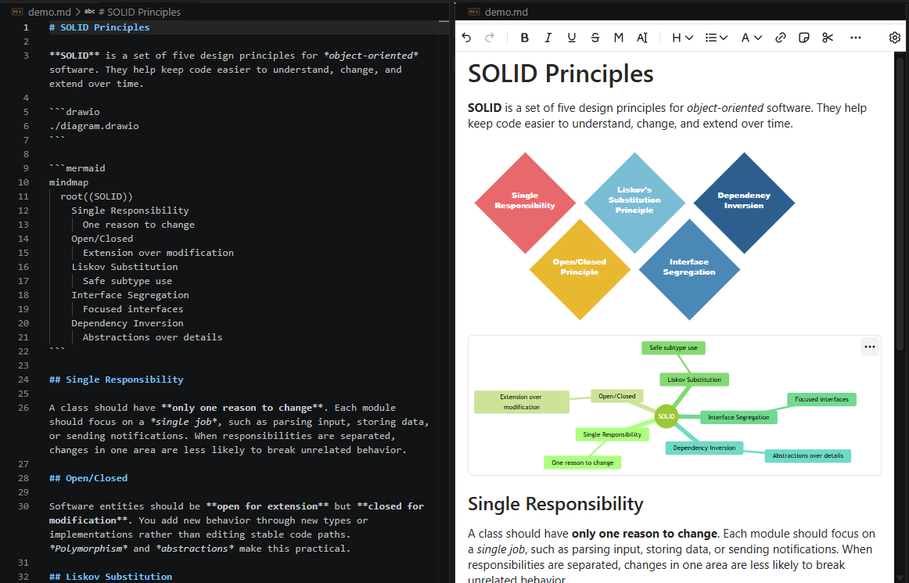

# Gravity Edit - Visual Markdown Editor

VS Code markdown editor extension using the [Gravity](https://github.com/gravity-ui/markdown-editor) markdown editor component.



## Capabilities

- Opens `.md` files in a visual (WYSIWYG) editor via **Open With** or **Gravity Edit: Open With Gravity Editor**.
- Preserves markdown source while editing with Gravity UI's full preset, including Mermaid diagrams, fenced code blocks syntax highlighting, HTML, and more.
- Resolves relative image paths from the markdown document location and refreshes externally edited images when the editor tab becomes visible.
- Supports VS Code Explorer shift+drag-drop:
  - image files become markdown image nodes with relative paths
  - `.drawio` files become ` ```drawio ` blocks with relative paths
  - other files become markdown file links with relative paths
- Renders ` ```drawio ` fenced blocks using draw.io's inline viewer. The block content can be either:
  - a relative or absolute path to a `.drawio` file (plain, native drawio XML)
  - inline draw.io XML (content starting with `<`)
- Keeps drawio diagrams in their native format, as raw `.drawio` XML files instead of hiding the source inside PNG/SVG metadata. This makes diagrams easier to review in diffs and much friendlier to AI tools.
- Keeps normal editor link behavior: plain click positions the cursor, Ctrl+click/Cmd+click opens links.

Example drawio blocks:

````markdown
```drawio
architecture.drawio
```
````

````markdown
```drawio
<mxGraphModel><root><mxCell id="0"/><mxCell id="1" parent="0"/>
  <mxCell id="2" value="Hello" vertex="1" parent="1">
    <mxGeometry x="100" y="100" width="120" height="60" as="geometry"/>
  </mxCell>
</root></mxGraphModel>
```
````

Example Mermaid block:

````markdown

````

## Build & package

```bash
npm run build:all
npx @vscode/vsce package --allow-missing-repository
```

Produces `*.vsix` in the project root.

## Local Install (Cursor / VS Code)

Install:
```bash
[cursor|code] --install-extension gravity-edit-x.y.z.vsix
```

Uninstall:
```bash
[cursor|code] --uninstall-extension gravity-edit-x.y.z.vsix
```
