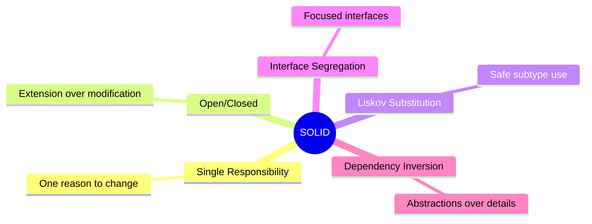

# SOLID Principles

**SOLID** is a set of five design principles for *object-oriented* software. They help keep code easier to understand, change, and extend over time.

```drawio
./diagram.drawio
```



## Single Responsibility

A class should have **only one reason to change**. Each module should focus on a *single job*, such as parsing input, storing data, or sending notifications. When responsibilities are separated, changes in one area are less likely to break unrelated behavior.

## Open/Closed

Software entities should be **open for extension** but **closed for modification**. You add new behavior through new types or implementations rather than editing stable code paths. *Polymorphism* and *abstractions* make this practical.

## Liskov Substitution

Subtypes must be usable anywhere their base type is expected *without breaking correctness*. If a function works with a base class, it should also work with any derived class **without surprises**. Subclasses should honor the **contracts** of their parents.

## Interface Segregation

Clients should not depend on methods they **do not use**. Prefer several *small, focused interfaces* over one large one. That keeps implementations simpler and reduces unnecessary **coupling**.

## Dependency Inversion

**High-level** modules should not depend on **low-level** details. Both should depend on *abstractions*. Concrete implementations are wired in at the edges, which makes systems easier to test and swap.
